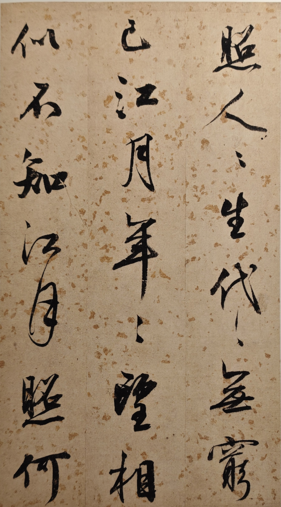
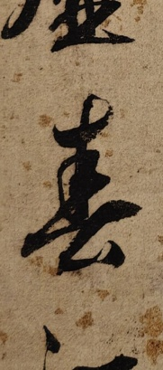
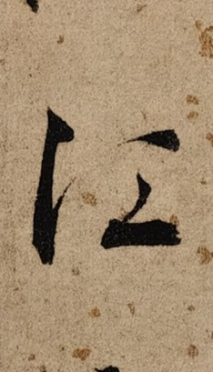
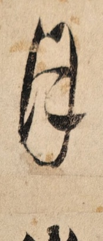

# 书法单字提取器 (Calligraphy Character Extractor)

从书法作品图片中自动提取单字，并生成 Anki 记忆卡包，用于书法学习和记忆。

## ✨ 功能特性

- 🖼️ **智能裁切**：自动识别书法作品的列结构，精准提取单字
- 📐 **自适应算法**：支持不同列数（2-4列）的书法作品
- 🎨 **草书优化**：针对行草书法特点优化，保留连笔字组
- 📚 **Anki 集成**：一键生成 `.apkg` 记忆卡包，直接导入 Anki
- 🔍 **视觉识别**：利用多模态 AI 自动识别字符内容并命名

## 📂 目录结构

```
calligraphy-extractor/
├── SKILL.md              # WorkBuddy Skill 定义文件
├── README.md             # 本文件
├── scripts/
│   ├── extract_chars.py  # 核心裁切脚本
│   ├── create_anki_deck.py  # Anki 卡包生成脚本
│   └── create_grid.py   # 缩略图网格生成（辅助工具）
└── examples/            # 示例图片和输出（可选）
```

## 🚀 使用方法

### 方法一：作为 WorkBuddy Skill 使用（推荐）

1. **安装 Skill**：
   - 在 WorkBuddy 中导入 `calligraphy-extractor.zip`
   - 或手动复制到 `~/.workbuddy/skills/calligraphy-extractor/`

2. **提取单字**：
   ```
   用户：帮我用 calligraphy-extractor 提取这些书法单字
   [上传书法图片]
   ```

3. **生成 Anki 卡包**：
   ```
   用户：帮我生成 Anki 记忆卡
   ```

### 方法二：独立使用脚本

#### 1. 安装依赖

```bash
pip install opencv-python pillow genanki
```

#### 2. 裁切单字

```bash
python scripts/extract_chars.py <图片目录> [列数] [输出尺寸]

# 示例：处理 3 列的书法图片，输出 512x512 的图片
python scripts/extract_chars.py ./书法图片/ 3 512
```

**输出**：
- `单字_v29/`：裁切后的单字图片
- `cell_positions_v29.json`：裁切位置信息（调试用）

#### 3. 识别并命名（需要 WorkBuddy 多模态能力）

```
用户：帮我识别这些单字的字符内容，并按诗文本顺序命名
```

脚本会自动：
- 利用 AI 视觉识别每个单字/字组
- 按诗文顺序命名（如 `春.jpg`、`江月.jpg`）
- 重复字自动加数字后缀（如 `月_1.jpg`、`月_2.jpg`）

#### 4. 生成 Anki 卡包

```bash
python scripts/create_anki_deck.py <命名后的图片目录> [输出文件名.apkg]

# 示例
python scripts/create_anki_deck.py ./单字_命名/ 书法记忆卡.apkg
```

**输出**：
- `书法记忆卡.apkg`：可直接双击导入 Anki

## 🎯 算法特点

### 裁切算法（v29）

1. **自适应列检测**：基于投影法自动识别列边界
2. **连通域分析**：精确提取字符轮廓，避免切碎连笔字
3. **Y 坐标聚类**：智能合并同一字符的分散笔画
4. **边距保护**：上下扩展 30% 边距，确保小笔画（点、挑）不被切掉
5. **去白边**：直接等比例缩放，无白底填充，字符占满画布

### Anki 卡包生成（v4）

1. **ASCII 文件名**：避免中文/特殊字符导致的媒体文件引用失败
2. **模板渲染**：`` 标签写入模板而非字段，确保图片正确显示
3. **UTF-8 BOM 编码**：CSV 导出兼容中文

## ⚙️ 参数调优

| 参数 | 默认值 | 说明 | 调优建议 |
|------|--------|------|----------|
| `COLS` | 3 | 书法作品列数 | 根据作品实际列数调整 |
| `CELL_SIZE` | 512 | 输出图片尺寸 | 如需更高清可设为 1024 |
| `PAD_RATIO` | 0.08 | 字符边距比例 | 草书连笔多变，建议 0.05-0.15 |
| `Y_MERGE_OVERLAP` | 0.15 | Y 重叠合并阈值 | 连笔多可降至 0.10，字迹疏朗可升至 0.25 |
| `Y_MERGE_GAP` | 0.50 | Y 间距合并阈值 | 同上 |

## 📦 输出示例

### 输入：原始书法作品



### 输出：裁切后的单字图片

| 春 (Chūn) | 江 (Jiāng) | 月 (Yuè) |
|-----------|-----------|-----------|
|  |  |  |

### Anki 卡片效果

**正面**（显示汉字）：
```
春
```

**背面**（显示书法图片）：
```
[书法图片：春]
```

> 💡 **提示**：导入 Anki 后，卡片正面显示汉字，背面显示对应的书法图片，方便记忆和临摹。

## ❓ 常见问题

### Q1：裁切出来的字不完整？

**A**：尝试调整 `PAD_RATIO` 参数（增大至 0.15）或 `Y_MERGE_OVERLAP`（降至 0.10）。

### Q2：连笔字组被强行拆分？

**A**：这是已知限制。算法会尽量保留连笔字组，但过度连笔可能无法识别。建议手动调整输出。

### Q3：Anki 导入后图片不显示？

**A**：
1. 确保使用 v4 及以上版本的 `create_anki_deck.py`
2. 导入前删除旧的卡组（避免模板冲突）
3. 检查文件名是否包含特殊字符（空格、括号等）

### Q4：如何批量处理多张书法作品？

**A**：可以编写批处理脚本，循环调用 `extract_chars.py`。

## 🤝 贡献指南

欢迎提交 Issue 和 Pull Request！

**开发建议**：
1. Fork 本仓库
2. 创建特性分支 (`git checkout -b feature/AmazingFeature`)
3. 提交更改 (`git commit -m 'Add some AmazingFeature'`)
4. 推送到分支 (`git push origin feature/AmazingFeature`)
5. 开启 Pull Request

## 📄 License

MIT License

## 🙏 致谢

- [OpenCV](https://opencv.org/) - 图像处理
- [Pillow](https://python-pillow.org/) - 图片 I/O
- [genanki](https://github.com/kerrickstoley/genanki) - Anki 卡包生成
- [WorkBuddy](https://www.workbuddy.ai/) - AI 助手框架

## 📧 联系方式

如有问题或建议，欢迎提交 Issue 或联系作者。

---

**⭐ 如果这个项目对你有帮助，请给它一个 Star！**