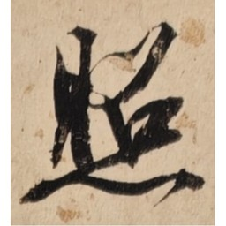
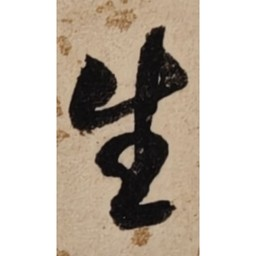
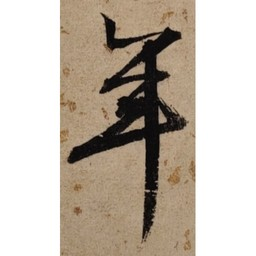

# 书法单字提取器 (Calligraphy Character Extractor)

从书法作品图片中自动提取单字，并生成 Anki 记忆卡包，用于书法学习和记忆。

## ✨ 功能特性

- 🖼️ **智能裁切**：自动识别书法作品的列结构，精准提取单字
- 📐 **自适应算法**：支持不同列数（2-4列）的书法作品
- 🎨 **草书优化**：针对行草书法特点优化，保留连笔字组
- 📚 **Anki 集成**：一键生成 `.apkg` 记忆卡包，直接导入 Anki
- 🔍 **视觉识别**：利用多模态 AI 自动识别字符内容并命名
- 🔴 **印章过滤**：自动检测并跳过红色印章区域
- 🗞️ **背景过滤**：自动过滤空白纸区域和低对比度噪声

## 📂 目录结构

```
calligraphy-extractor/
├── SKILL.md              # WorkBuddy Skill 定义文件
├── README.md             # 本文件
├── scripts/
│   ├── extract_chars.py  # 核心裁切脚本 (v34)
│   ├── create_anki_deck.py  # Anki 卡包生成脚本
│   └── create_grid.py   # 缩略图网格生成（辅助工具）
└── examples/            # 示例图片和输出
```

## 🚀 使用方法

### 方法一：作为 WorkBuddy Skill 使用（推荐）

1. **安装 Skill**：
   - 在 WorkBuddy 中导入 `calligraphy-extractor.zip`
   - 或手动复制到 `~/.workbuddy/skills/calligraphy-extractor/`

2. **提取单字**：
   ```
   用户：帮我用 calligraphy-extractor 提取这些书法单字
   [上传书法图片]
   ```

3. **生成 Anki 卡包**：
   ```
   用户：帮我生成 Anki 记忆卡
   ```

### 方法二：独立使用脚本

#### 1. 安装依赖

```bash
pip install opencv-python pillow numpy genanki
```

#### 2. 裁切单字

```bash
python scripts/extract_chars.py <图片目录> [列数] [输出尺寸]

# 示例：处理 3 列的书法图片，输出 512x512 的图片
python scripts/extract_chars.py ./书法图片/ 3 512
```

**输出**：
- `单字_v512/`：裁切后的单字图片（512x512 方形画布）
- `cell_positions_单字_v512.json`：裁切位置信息（调试用）

#### 3. 识别并命名（需要 WorkBuddy 多模态能力）

```
用户：帮我识别这些单字的字符内容，并按诗文本顺序命名
```

脚本会自动：
- 利用 AI 视觉识别每个单字/字组
- 按诗文顺序命名（如 `春.jpg`、`江月.jpg`）
- 重复字自动加数字后缀（如 `月_1.jpg`、`月_2.jpg`）

#### 4. 生成 Anki 卡包

```bash
python scripts/create_anki_deck.py <命名后的图片目录> [输出文件名.apkg]

# 示例
python scripts/create_anki_deck.py ./单字_命名/ 书法记忆卡.apkg
```

**输出**：
- `书法记忆卡.apkg`：可直接双击导入 Anki

## 🎯 算法特点

### 裁切算法（v34）

1. **OTSU 二值化** + 自适应闭运算（自动尝试 4 种 kernel 尺寸）
2. **连通域检测** + Y 坐标聚类合并（宽松条件，保留小笔画）
3. **水平投影深谷分割**（对过高区域尝试分割，避免强行拆分连笔字组）
4. **Tight Crop v34**：非白像素检测（`< 235`）+ CLAHE 对比度增强，保留淡墨笔画
5. **印章过滤**：HSV 色彩空间检测红色像素（红色占比 > 3% 判定为印章，自动跳过）
6. **背景过滤**：检测低对比度区域（标准差 < 15）或墨迹占比极低（< 0.3%），自动跳过
7. **100% 填充画布**：字符完全填满 512x512 方形画布，不留白边

### Anki 卡包生成（v4）

1. **ASCII 文件名**：避免中文/特殊字符导致的媒体文件引用失败
2. **模板渲染**：`` 标签写入模板而非字段，确保图片正确显示
3. **UTF-8 BOM 编码**：CSV 导出兼容中文

## ⚙️ 参数调优

在 `scripts/extract_chars.py` 顶部可调整以下参数：

| 参数 | 默认值 | 说明 | 调优建议 |
|------|--------|------|----------|
| `CELL_SIZE` | 512 | 输出图片尺寸 | 如需更高清可设为 1024 |
| `N_COLS` | 3 | 书法作品列数 | 根据作品实际列数调整 |
| `TARGET_FILL` | 1.0 | 字符填充画布比例 | 1.0 = 100% 填充（无白边），0.8 = 80% 填充（留白边） |
| `PAD_RATIO` | 0.0 | Tight crop 边距比例 | 0.0 = 无白边，0.05 = 5% 边距 |
| `Y_MERGE_OVERLAP` | 0.05 | Y 重叠合并阈值 | 连笔多可降至 0.03，字迹疏朗可升至 0.10 |
| `Y_MERGE_GAP` | 0.20 | Y 间距合并阈值 | 同上 |
| `EXCLUDE_FILES` | `['v29_vs_v30_comparison.jpg']` | 排除非源图 | 可添加其他需要排除的文件名 |

## 📦 输出示例

### 输入：原始书法作品


### 输出：裁切后的单字图片

| 照 (Zhào) | 流 (Liú) | 不 (Bù) |
|-----------|-----------|-----------|
|  |  |  |

### Anki 卡片效果

**正面**（显示汉字）：
```
春
```

**背面**（显示书法图片）：
```
[书法图片：春]
```

> 💡 **提示**：导入 Anki 后，卡片正面显示汉字，背面显示对应的书法图片，方便记忆和临摹。

## ❓ 常见问题

### Q1：裁切出来的字不完整？

**A**：尝试调整 `PAD_RATIO` 参数（增大至 0.05）或 `Y_MERGE_OVERLAP`（降至 0.03）。

### Q2：连笔字组被强行拆分？

**A**：v34 算法已优化，对过高区域（> 1.3 倍字高）才尝试水平投影分割，避免过度拆分。如仍有问题，可手动调整输出。

### Q3：Anki 导入后图片不显示？

**A**：
1. 确保使用 v4 及以上版本的 `create_anki_deck.py`
2. 导入前删除旧的卡组（避免模板冲突）
3. 检查文件名是否包含特殊字符（空格、括号等）

### Q4：如何批量处理多张书法作品？

**A**：可以编写批处理脚本，循环调用 `extract_chars.py`。

### Q5：印章被当成字提取了？

**A**：v34 已内置印章过滤功能（HSV 检测红色像素），自动跳过印章区域。

### Q6：输出的图片有白边？

**A**：v34 默认 `TARGET_FILL=1.0` 和 `PAD_RATIO=0.0`，字符完全填满画布。如有白边，检查参数是否被修改。

## 🤝 贡献指南

欢迎提交 Issue 和 Pull Request！

**开发建议**：
1. Fork 本仓库
2. 创建特性分支 (`git checkout -b feature/AmazingFeature`)
3. 提交更改 (`git commit -m 'Add some AmazingFeature'`)
4. 推送到分支 (`git push origin feature/AmazingFeature`)
5. 开启 Pull Request

## 📄 License

MIT License

## 🙏 致谢

- [OpenCV](https://opencv.org/) - 图像处理
- [Pillow](https://python-pillow.org/) - 图片 I/O
- [genanki](https://github.com/kerrickstoley/genanki) - Anki 卡包生成
- [WorkBuddy](https://www.workbuddy.ai/) - AI 助手框架

## 📧 联系方式

如有问题或建议，欢迎提交 Issue 或联系作者。

---

**⭐ 如果这个项目对你有帮助，请给它一个 Star！**
